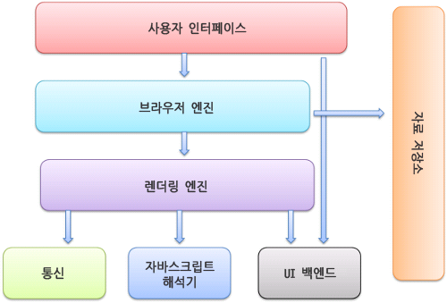

# 브라우저는 어떻게 작동하는가

## 주요기능

- URI를 입력할 수 있는 주소 표시 줄
- 이전 버튼과 다음 버튼
- 북마크
- 새로 고침 버튼과 현재 문서의 로드를 중단할 수 있는 정지 버튼
- 홈 버튼

## 기본구조

## 동작과정

1. **URL 입력 및 요청:** 사용자가 URL을 입력하면 브라우저는 해당 주소의 웹 서버에 HTTP 요청을 보냅니다.
2. **서버 응답 및 데이터 수신:** 서버는 요청을 처리하고 HTML, CSS, JavaScript 파일 등을 브라우저에게 응답으로 보냅니다.
3. **HTML 파싱 및 DOM 생성:** 브라우저는 HTML을 파싱하여 Document Object Model (DOM) 트리를 만듭니다. 이 트리는 웹 페이지의 구조를 나타냅니다.
4. **CSS 파싱 및 CSSOM 생성:** CSS 파일도 파싱되어 CSS Object Model (CSSOM) 트리가 생성됩니다. 이것은 페이지의 스타일을 정의합니다.
5. **렌더 트리 생성:** DOM과 CSSOM을 결합하여 렌더 트리를 생성합니다. 이 트리는 페이지의 시각적 표현을 나타내며, 각 요소의 크기와 위치를 포함합니다.
6. **레이아웃 단계:** 렌더 트리를 기반으로 브라우저는 각 요소의 크기와 위치를 계산합니다.
7. **페인팅:** 계산된 스타일과 레이아웃 정보를 사용하여 화면에 페이지를 그립니다. 여기에는 텍스트, 이미지, 다른 시각적 요소들이 포함됩니다.
8. **JavaScript 실행:** 필요한 경우 JavaScript가 실행되어 동적인 기능을 추가하거나 페이지를 변경합니다.
9. **로드 완료:** 모든 요소와 스크립트가 로드되고 실행되면 페이지 로딩이 완료됩니다. 사용자는 이제 페이지와 상호 작용할 수 있습니다.

# **DOM**

### 문서객체모델의 약자(The Document Object Model)

- 웹 문서의 구조를 표현한 모델
- 브라우저에서 로드되며 노드트리로 표현하는 document 모델
- DOM은 HTML과 자바스크립트를 이어주는 공간

# **Virtual DOM**

### 가상 돔이란,

실제 DOM(Document Object Model)을 조작하는 방식이 아닌, 실제 DOM을 모방한 가상의 DOM을 구성해 원래 DOM과 비교하여 달라진 부분을 리렌더링 하는 방식으로 작동

### VirtualDom 작동원리

1. UI가 변경을 감지하면 UI를 Virtual DOM으로 렌더링한다. (실제 화면상 렌더링 되는 것이 아닌 비교를 위한 가상 렌더링)
2. 현재 Virtual DOM과 이전 Virtual DOM을 비교해 차이를 계산한다.
3. 변경된 부분을 실제 DOM에 반영한다.

실제 DOM조작과 달리 메모리 상에서만 동작하고 실제 DOM조작을 최소화해서 비용이 적게 들 수 있다

# CSR

Client Side Rendering
클라이언트 사이드의 비중을 굉장히 높게 가져가는 방식

1. 사용자가 웹사이트에 접근하면, 서버는 HTML의 기본 뼈대와 JavaScript 파일을 클라이언트(브라우저)에 전달한다.
2. 클라이언트는 JavaScript를 실행하여 필요한 데이터를 API 호출을 통해 가져오고, 이를 기반으로 페이지를 동적으로 렌더링한다.

# SSR

Server Side Rendering

### 작동 방식

1. 사용자가 웹사이트에 접근하면, 서버는 요청에 따라 완전한 HTML 페이지를 생성하여 클라이언트에 전달한다

2. 클라이언트는 이 HTML을 바로 렌더링하여 사용자에게 보여준다

# SPA

한 개(Single)의 Page로 구성된 Application

CSR방식을 사용

### 작동 방식

- SPA는 웹 에플리케이션에 필요한 모든 정적 리소스를 최초 접근 시 단 한번만 다운로드한다.
- 이후 새로운 페이지 요청 시, 페이지 갱신에 필요한 데이터만을 JSON으로 전달받아 페이지를 갱신한다. 기존 페이지의 내부를 수정해서 보여주는 방식이다.
- SPA를 일반적으로 CSR(Client Side Rendering) 방식으로 렌더링한다고 말한다.

# MPA

여러 개(Multiple)의 Page로 구성된 Application

SSR방식을 사용

### 작동 방식

- 새로운 페이지를 요청할 때마다 서버에서 렌더링된 정적 리소스(HTML, CSS, JavaScript)가 다운로드된다.
- 페이지 이동하거나 새로고침하면 전체 페이지를 다시 렌더링한다.
- MPA는 SSR(Server Side Application) 방식으로 렌더링한다.
