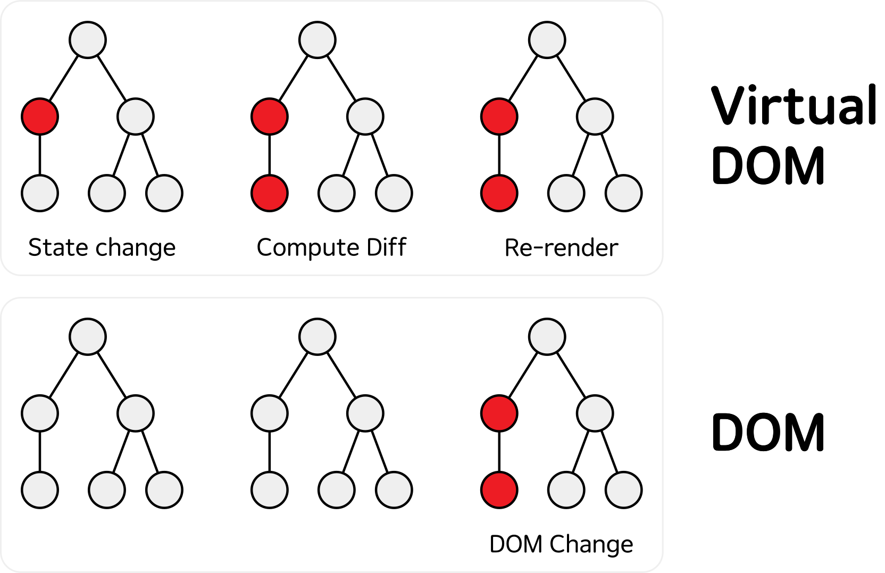

# 1주차 과제

## 브라우저의 동작 과정
### 브라우저의 구성 요소

* 사용자 인터페이스
* 브라우저 엔진
* 렌더링 엔진
* 통신
* UI 백엔드
* 자바스크립트 해석기
* 자료 저장소

### 렌더링 엔진
렌더링 엔진의 역할은 요청 받은 화면을 브라우저 화면에 표시하는 일이다.

#### 동작 과정
렌더링 엔진의 기본적인 동작 과정은 다음과 같다.
1. HTML 파싱
2. 노드들로 이루어진 DOM 트리를 만든다.
3. 외부의 CSS 파일과 각 노드들의 인라인 스타일을 파싱하여 스타일을 입힌 렌더 트리를 만든다.
4. 렌더 트리가 만들어지면, 각 노드들의 위치가 주어진다.
5. paint() 메서드를 호출해 화면을 출력한다.

## DOM
**DOM**(Document Object Model)은 HTML, XML 문서의 프로그래밍 인터페이스이다.[^1]

단순히 문서(Document)인 HTML을 브라우저가 이해하기 위해선 객체(Object)로 변환하는 과정이 필요하고, 브라우저에 의해 해석되어 실제 문서를 나타내는 노드 트리가 DOM인 것이다. 이러한 DOM은 자바스크립트로 해당 문서에 노드 추가, 삭제, 변경, 이벤트 처리, 수정 등을 가능케 하는 API를 제공한다.

즉, DOM은 HTML과 자바스크립트를 이어주는 공간으로, 작성한 HTML을 자바스크립트가 이해할 수 있도록 오브젝트로 변환하는 것이다.

### 단점
만약 DOM에 변화가 생긴다면, 브라우저는 그 변화를 반영하기 위해 리렌더링 과정을 거치게 된다. 즉, HTML 파싱부터 다시 시작한다는 것이다. 이러한 과정은 비효율적이며며, 프로그램의 성능을 저하시킨다.

그래서 등장한 것이 Virtual DOM이다.

## Virtual DOM
**Virtual DOM**(이하 가상 돔)은 실제 돔의 노드 트리를 복제한 자바스크립트 객체이다. 수정 사항이 여러 번 있더라도 돔과 달리 딱 한 번만 렌더링을 한다.

아래는 가상 돔의 작동 과정이다.

1. 변화가 생기면 새로운 돔 트리를 생성한다.
2. Diff 함수를 통해서 변경 전 돔 트리와 변경 후의 돔 트리를 받아온다.
3. 두 돔 트리의 변화된 부분만을 확인한다.
4. 실제 돔에 변경된 부분을 적용한다.

### Diffing Algorithm
**Diffing Algorithm**은 React에서 두 개의 트리를 비교할 때 두 엘리먼트에서 변경 전의 엘리먼트부터 비교하고, 그 엘리먼트의 타입에 따라 트리를 구축하는 방식의 알고리즘이다.[^2]

#### 엘리먼트의 타입이 같은 경우
변경 전 엘리먼트의 속성과 변경 후 엘리먼트의 속성을 비교하여 동일한 내용은 유지하고, 변경된 속성들만 갱신한다.

#### 엘리먼트의 타입이 달라진 경우
이전 트리를 삭제하고 완전히 새로운 트리를 만든다.

## MPA
**MPA**(Multi Page Application)은 변경 사항이 있을 때마다 새로운 HTML 페이지를 받아와서 페이지를 새로 렌더링하는 방식이다.

매번 서버로부터 HTML 파일을 내려받기 때문에 새로고침이 발생하고, 그럴 때마다 화면이 깜빡인다는 단점이 있다.

초창기 단순한 웹에서는 별로 문제가 되지 않았지만, 웹이 발전을 하면서 사진, 영상, 페이지 간의 상호작용이 많아지고 복잡도가 높아지면서 성능 이슈가 생기는 문제가 있었다.

이를 보완하기 위해 원하는 부분만 동적으로 받아오는 **AJAX**를 사용할 수 있다.

## SPA
**SPA**(Single Page Applicaion)는 하나의 페이지로 구성된 애플리케이션을 말한다.

변경 사항이 있는 부분에만 데이터를 요청한다.

새로고침이 발생하지 않아서 사용자 경험에 좋다.

## CSR vs SSR
### CSR
**CSR**(Client Side Rendering)은 클라이언트에서 렌더링을 하는 방식이다.
SPA에서 채택한 방식이다.

#### 작동 과정
1. 사용자가 웹에 접속한다.
2. 브라우저가 서버에 요청을 보낸다.
3. 서버는 자바스크립트와 CSS를 불러올 수 있는 빈 HTML 파일을 넘겨준다.
4. 브라우저는 자바스크립트 코드를 다운로드 받는다.
5. 브라우저는 렌더링을 해서 사용자에게 페이지를 제공하게 된다.

#### 장점
* 화면 깜빡임이 없다.
* 초기 로딩 이후 구동 속도가 빠르다.
* 서버에 부하가 적다.

#### 단점
* 자바스크립트 파일을 다운로드 받고 동적으로 DOM을 생성하는 시간을 기다려야 하기 때문에 초기 로딩 속도가 느리다.
* HTML에 내용이 텅 비어있기 때문에 검색 엔진이 색인을 할만한 컨텐츠가 없으므로, 검색 엔진 최적화(SEO)에 불리하다.

### SSR
**SSR**(Server Side Rendering)은 서버에서 렌더링을 하는 방식이다.
MPA에서 채택한 방식이다.

#### 작동 과정
1. 사용자가 웹에 접속한다.
2. 브라우저가 서버에 요청을 보낸다.
3. 서버는 즉시 페이지에 필요한 데이터를 넣어 모두 삽입하고, css까지 적용해서 렌더링 준비를 마친 HTML과 자바스크립트를 전달한다.
4. 브라우저는 바로 전달받은 페이지를 띄운다.
5. JS Code를 다운로드 하고 로직을 연결한다.

#### 장점
* 모든 콘텐츠가 담겨 있으므로 SEO에 유리하다.
* JS를 다운로드 받고 실행하기 전에 사용자가 화면을 볼 수 있어 초기 구동 속도가 빠르다.

#### 단점
* 화면 깜빡임이 발생한다.
* JS 로직이 연결될 때까지 사용자의 입력에 응답할 수 없다.
* 매번 요청을 보내기 때문에 서버에 부하가 생길 수 있다.

#### 번외. SSG
**SSG**(Static Site Generation)는 서버에서 HTML을 보내주는 것은 SSR과 비슷하지만, SSR은 요청할 때 즉시 HTML 파일을 만들어서 제공하고 SSG는 미리 다 만들어둔 정적 페이지를 제공한다는 차이점이 있다.

SSR은 데이터가 바뀌는 페이지에 적합하고, SSG는 바뀔 일이 거의 없는 페이지에 적합하다.

### 장단점 비교
|| CSR | SSR |
|---|---|---|
| 장점 | - 화면 깜빡임이 없다. - 초기 로딩 이후 구동 속도가 빠르다. - 서버에 부하가 적다. | - SEO에 유리하다. - 초기 구동 속도가 빠르다. |
| 단점 | - SEO에 불리하다. - 초기 로딩 속도가 느리다. | - 화면 깜빡임이 발생한다. - 서버 부하가 있다.

### Universal Rendering
**Universal Rendering**은 초기 렌더링은 SSR을 사용하고 이후 다른 페이지로 이동할 때에는 CSR 방식을 사용하는 것이다.

초기 로딩 속도가 빠른 SSR의 장점, 페이지를 이동할 때 깜빡임이 없다는 CSR의 장점, SEO를 개선할 수 있다는 특징이 있다.

---------

[^1]: [DOM 소개 - Web API | MDN](https://developer.mozilla.org/ko/docs/Web/API/Document_Object_Model/Introduction)

[^2]: [[React] Virtual DOM, 가상 돔이란?](https://velog.io/@xnelb013/React-Virtual-DOM-%EA%B0%80%EC%83%81-%EB%8F%94%EC%9D%B4%EB%9E%80)