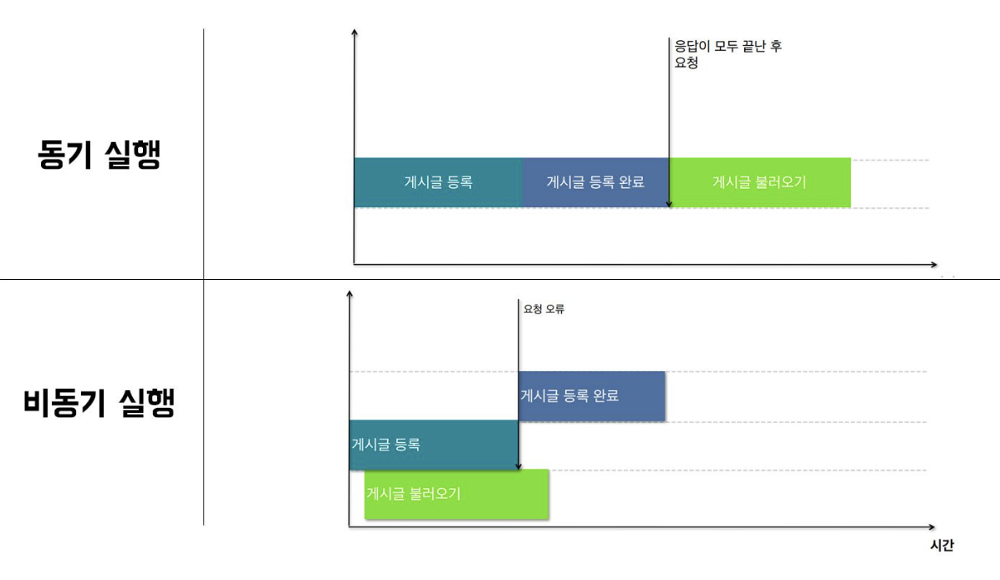

# REACT HOOKS

## react hook이란?

리액트 훅은 리액트 클래스형 컴포넌트에서 이용하던 코드를 작성할 필요없이 함수형 컴포넌트에서 다양한 기능을 사용할 수 있게 만들어준 라이브러리

리액트에서 제공하는 내장 훅(useState, useEffect, ... ) 과 사용자가 직접 정의할 수 있는 Custom Hooks가 있다.

## react hook 의 등장

react hook 이 등장하기전까진 클래스컴포넌트를 사용

클래스컴포넌트에서 상태관리, 데이터 가져오기, lifecycle method(컴포넌트 등장, 업데이트, 사라짐 관리)

등을 함

**문제점 1. 상태관리** 

그런 클래스 컴포넌트 속에서 상태 관리 로직을 그 외 컴포넌트에서 동일하게 쓰고 싶어도 그 기능 만 딱 떼와서 재활용은 힘들었음

이부분을 해결하기 위해 HOC나 Render Props 패턴을 사용했지만 코드가 복잡해지고 Wrapper Hell 이라는 문제도 발생

render props : 반복되는 로직을 쉽게 재사용 할 수 있게 해주고, 컴포넌트 코드를 작성하는 과정에서 컴포넌트를 함수로 감싸는 것이 아니라 JSX에서 렌더링하는 방식으로 사용할 수 있게 해주는 패턴

HOC: 리트 컴포넌트를 인자로 받아 컴포넌트를 반환하는 함수

**문제점2. this나 생명주기 등 클래스가 주는 혼동 발생**

[this 는 자신이 속한 객체 or 자신이 생성할 인스턴스를 가리키는 자기 참조 변수]

[`this`를 이용해서 클래스를 정의하면, 다음부터 **새로 만들어지는 객체는 자기 자신을 이용한다]**
**문제점 3. 중복되는 로직**

등의 문제로 인해 상태관리로직을 재사용 하기위해 React Hook이 등장

## 훅의 규칙

1. 같은 훅을 여러 번 호출할 수 있다.
    
    ```
    function Form() {
      // useState 여러번 호출 가능
      const [name, setName] = useState('Mary');
      const [surname, setSurname] = useState('Poppins');
    
      // 이하 생략
    ```
    
2. 컴포넌트 **최상위**(at the top level)에서만 호출할 수 있다. 반복문, 조건문, 중첩된 함수 내에서 훅을 사용할 수 없다.
    
    => 컴포넌트 최상위에서 훅을 호출하면, 컴포넌트가 렌더링 될 때마다 항상 동일한 순서로 Hook이 호출되는 것이 보장된다.
    
    이는 React가 useState와 useEffect 등의 훅이 여러 번 호출되는 중에도 훅의 상태를 올바르게 유지할 수 있도록 해준다.
    
    > 훅의 호출 순서가 같아야 하는 이유는?
    > 
    > 
    > => React가 특정 state가 어떤 `useState` 호출에 해당하는지 알 수 있는 이유는 **React가 Hook이 호출되는 순서에 의존**하기 때문이다. 모든 렌더링에서 Hook의 호출 순서는 같기 때문에 state를 구분할 수 있다.
    > 
3. Hook은 React 함수 내에서만 호출할 수 있다. 리액트 훅은 함수형 컴포넌트에서 호출해야하며, 추가적으로 custom hooks에서 또한 호출할 수 있다.
4. 비동기 함수(async 키워드가 붙은 함수)는 콜백함수로 사용할 수 없다.
    
    ```
    export default function App(){
      // useEffect Hook 내부에 비동기 함수가 들어가므로 에러 발생
      useEffect(async () => {
        await Promise.resolve(1)
      }, [])
    
      return {
        <div>
          <div>Test</div>
        </div>
      }
    ```
    

ㄴuseEffect훅의 첫번째 인자로 들어가는 함수(=콜백함수)에 직접 async키워드를 붙이면 안된다는 뜻, useEffect의 콜백함수로는 동기함수가 필요

[비동기함수는 무조건 promise(비동기 작업의 최종결과를 나타내는 객체[이게 있으면 이후 결과가 나오면 확인가능])를 반환[작업상태에 따라 Pending(대기), Fulfilled(이행,성공), Rejected(거부,실패)로 반환]

[동기함수는 흔히 알듯이 return 뒤의 값을 반환]

[비동기 함수에 대해]



예시) 시글을 등록 후 게시글을 불러왔을 때 게시글이 불러와지지 않는 경우가 있다. 이러한 문제는 게시글 등록 요청 후 백엔드 컴퓨터에 요청을 전송하고 데이터가 처리된 후 게시글 불러오기 과정이 실행되어야 하는데 데이터 처리 이전에 게시글 불러오기 과정이 실행되어져 문제가 발생한다.

ㄴ 이런 실행방식 = ***비동기실행***(서버 컴퓨터의 작업이 끝날때까지 기다리지않음)

이런 실행방식을 하는 함수가 비동기함수임.

긴 시간이 걸리는 작업을 실행시켜놓고 다음 코드라인을 진행하는 것.

***콜백 함수는 전달인자로 다른 함수에 전달되는 함수***

## 리액트 훅의 종류


기본적으로 

컴포넌트 상태를 관리할 수 있는 `useState`

컴포넌트 생애주기에 개입할 수 있는 `useEffect` 

컴포넌트 간의 전역 상태를 관리하는 `useContext`

## useState

리액트 훅의 기본, 가장 많이 사용하는 훅, 컴포넌트의 상태를 관리할 수 있는 훅

```
const [number, setNumber] = useState(1);
```

위 코드에서는 `number` 라는 상태를 `useState` 훅을 통해 관리하고 있다. `useState` 훅의 인자로 전달된 `1` 이라는 값이 `number`의 초기값이 되고, 훅을 통해 반환되는 `[number, setNumber]`에서 `number`를 통해 상태의 값에 접근할 수 있고, `setNumber` 메서드를 호출함으로써 상태 값을 변경할 수 있다.

`useState` 에서 반환된 배열의 두번째 값인 setter 함수를 호출하면 상태 값을 변경할 수 있고, 상태 값이 변경되면 해당 컴포넌트는 다시 렌더링된다.

=> `useState(초기값)`에서 인자로 전달된 값을 상태의 초기값으로 사용한다. 하지만 이후 setter 함수에 의해 상태의 값이 변경되었다면, 다음 렌더링에서는 그 상태를 유지다.

> setState 호출 => 상태 변경 => 리렌더링(변경된 상태값 사용)
> 

## useEffect

컴포넌트 내의 상태의 변화가 있을때 이를 감지하여 특정 작업을 해줄 수 있는 훅

[sideEffect의 처리를 위해서 사용]

sideEffect란?

=> 컴포넌트가 화면에 렌더링된 이후에 **비동기**로 처리되어야 하는 부수적인 효과들을 말한다. 예를 들어 API를 호출하는 경우 데이터를 비동기적으로 가져와야 하는데, 만약 그렇지 않다면 데이터를 가져오는 시간 동안 렌더링이 지연될 수도 있기 때문이다.

sideEffect란 다음과 같은 경우를 모두 포함한다.

- 함수에서 함수 안의 내용물만으로 결과값을 만드는 것 외에 다른 행위들
- 함수의 output를 만들기 위해 외부에 값을 사용하는 것
- 외부 변수를 함수 안에서 변경시키는 것

## **사용 방법**

```
useEffect(()=>{
   //
}, []) // 의존성 배열
```

`useEffect`의 두번째 인자로 어떤 값을 전달하는 지에 따라, 첫번째 인자로 전달된 콜백 함수(effect)가 언제 실행되는 지가 결정된다.( 두번째 인자라는건 위 예시상에서 [ ] 자리)(첫번째 인자가 { } 자리 즉 sideEffect가 들어가는 자리)

//여기서 ( *() ⇒ … )  에서 * 자리에 아무것도 안쓰면 동기함수, async 쓰면 비동기 함순데 동기함수를 써야되니 async를 쓰면 안된다

**"useEffect의 첫 번째 인자(콜백 함수)는 동기 함수여야 한다"**

**"근데 그 콜백 함수 안에서 비동기 작업(side effect)을 한다"**

[위 규칙 참고]

(두번째 인자기준)

### 1. 아무것도 전달하지 않으면

```
useEffect(()=>{

}) // 아무것도 전달 x
```

기본적으로는 **첫 렌더링(마운트)**과 **그 이후의 모든 업데이트**에 대해서 effect를 수행하게 된다.

### 2. 빈 배열 `[]` 전달 시,

```
useEffect(() => {
  console.log("Component Loaded");
}, []);
// 컴포넌트가 마운트 됐을때만 실행된다. (componentDidMount)
```

맨 처음 컴포넌트 생성 시, 즉 **마운트** 될 때만 실행된다.

### 3. 변수 전달 시, `[count]`

```
useEffect(() => {
  document.title = `You clicked ${count} times`;
}, [count]);
// count가 바뀔 때만 effect를 재실행
```

맨 처음 마운트 되었을 때와, `count` state의 값이 바뀔 때만 실행된다.

### useEffect 실행 타이밍

useEffect로 전달된 함수는 `컴포넌트 렌더링 - 화면 업데이트 - useEffect 함수 실행` 순으로 실행한다. 즉, useEffect실행이 ***최초 렌더링 이후*** 에 된다.

### clean up(첫번째인자(콜백 함수 내)에 return함수가 있는것)

```
useEffect(()=>{
    console.log("Component Loaded");
    const handleScroll = () => {
        console.log(window.scrollY);
    };

    document.addEventListener("scroll", handleScroll);

    return () => document.removeEventListener('scroll', handleScroll);
}, []);
```

`window`에 스크롤에 대한 event를 등록하고, 컴포넌트가 사라질 때, 이를 해제해줄 수 있다.

=> useEffect 안의 첫 번째 인자인 **콜백함수 내 return 문**은 **해당 컴포넌트가 제거될 때(unmount될 때) 실행된다**.

## 어휘 뜻

생명주기 : 컴포넌트가 랜더링이 시작되는 지점부터 랜더링이 끝나는 지점

mount지점  : 렌더링이 시작되는 지점

unmount 지점 : 렌더링이 끝나는 지