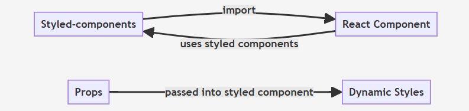

# CSS

Cascading Style Sheet로 html로 뼈대를 잡아준 문서에, style을 입혀주는 역할을 한다

css문제

- Global namespace: 모든 스타일이 global에 선언되어 중복되지 않는 class 이름을 적용해야 하는 문제
- Dependencies: css 간의 의존관계를 관리하기 힘든 문제
- Dead Code Elimination: 기능 추가, 변경, 삭제 과정에서 불필요한 CSS를 제거하기 어려운 문제
- Minification: 클래스 이름의 최소화 문제
- Sharing Constants: JS 코드와 상태 값을 공유할 수 없는 문제
- Non-deterministic Resolution: CSS 로드 순서에 따라 스타일 우선 순위가 달라지는 문제
- Isolation: CSS와 JS가 분리된 탓에 상속에 따른 격리가 어려운 문제

이 불편함을 해결하기 위해 나온게 CSS-in-CSS 의 CSS Modules 와 CSS-in-JS

# CSS in JS

JavaScript로 구성 요소의 스타일을 지정하는 스타일링 기술이다. 이 JavaScript의 코드를 해석해가면 CSS가 생성되어 DOM`<style>` 에 첨부된다. 선언적이고 유지 관리 가능한 방식으로 스타일을 설명하기 위해 JavaScript를 사용하여 CSS를 컴포넌트 자체로 추상화할 수 있다.
[=자바스크립트로 css 스타일을 지정하는 기술]

Css-in-JS 라이브러리

- styled-components
- emotion
- JSS
- tailwind-css
- etc…

이중 가장 대표적인 라이브러리는

## **Styled-components**

styled-components의 설정 및 사용

React 애플리케이션에서 `styled-components`를 설정하는 것은 간단하다. 먼저 npm이나 yarn을 사용하여 설치한다.

```bash
npm install styled-components
# 또는
yarn add styled-components

```

`styled-components`를 사용하려면 컴포넌트 파일에 먼저 import해야 한다.

```jsx
import styledfrom 'styled-components';

```

`styled-components`를 사용하면 `styled` 객체를 사용하여 스타일이 적용된 새로운 컴포넌트를 생성한다. 다음은 스타일이 적용된 버튼의 예

```jsx
constButton = styled.button`
  padding: 10px 20px;
  background-color: palevioletred;
  color: white;
  border-radius: 4px;
  border: none;
  font-size: 1em;
`;

functionApp() {
return <Button>Click me</Button>;
}

```

Props에 따라 컴포넌트의 스타일을 변경하려면, 컴포넌트의 Props을 사용하는 함수를 사용할 수 있다.

```jsx
constButton = styled.button`
  /* ... */
  background-color: ${props => props.primary ? 'palevioletred' : 'white'};
  color: ${props => props.primary ? 'white' : 'palevioletred'};
`;

functionApp() {
return (
    <>
      <Button primary>Primary Button</Button>
      <Button>Default Button</Button>
    </>
  );
}

```

이 예제에서 `Button` 컴포넌트는 `primary` Props을 받아서 배경색과 텍스트 색상을 결정한다.



## CSS-in-JS의 장점

### 1. 유지보수 용이

기존엔 CSS 파일을 따로 가지게 되어 CSS 문서도 유지보수의 대상에 들어갔지만, CSS-in-JS를 사용하면 컴포넌트 단위로 스타일을 적용하기 때문에, 컴포넌트 모듈 하나에서 스타일과 동작을 한번에 관리할 수 있다. 스타일을 고치기 위해 불필요하게 프로젝트 폴더에서 왔다 갔다 하는 일을 줄일 수 있다.

### 2. 스타일 충돌 방지

일반 CSS 파일을 사용해서 스타일을 지정해줬을 때는 본의 아니게 클래스 명이 겹치게 될 경우 의도치 않은 스타일 충돌이 일어나게 된다.

[이유 = 자바스크립트나 다른 언어들은 변수나 함수이름을 정할때 스코프 라는게 있어서 특정 영역 안에서만 유효하지만 일반 css는 기본적으로 스코프가 없다.]

이를 방지하기 위해 BEM 작명 기법이나, module CSS를 사용할 수 있지만 완전하지않고 귀찮다는 문제점이 존재했다. css-in-js는 컴포넌트 자체에 스타일을 지정하는 방식으로 충돌을 쉽게 막을 수 있다.

### 3. 스타일 상속의 용이

styled-components 기준으로는 버튼의 padding, font-family와 같은 공통 속성은 그대로 가져가고(상속), 버튼의 배경 색만 다르게 주고 싶을 때 상속을 이용하면 쉽게 바꿀 수 있다.

```jsx
const Button = styled.button`
  border: none;
  cursor: pointer;
  font-size: 18px;
  padding: 16px;

  background-color: #6500c3;
  color: #ffffff;
`;
const StyledButton = styled(Button)`
  background-color: #fee500;
  color: rgba(0, 0, 0, 0.8);
`;
```

예를 들어 StyledButton은 Button 컴포넌트의 스타일을 공유한 상태로 고유의 스타일을 추가해 나갈 수 있다.

### 4. 조건문을 활용한 동적인 스타일

```jsx
const Button = styled.button`
  border-radius: ${({ round }) => (round ? "9999px" : "8px")};
`;
```

css의 스타일을 지정한다고 하지만, 우선 CSS-in-JS는 자바스크립트의 문법을 활용하므로 조건문을 활용해 스타일을 다르게 지정해줄 수 있다.

## 단점

### 1. 새로운 것을 또 배워야 하는 리스크

기존 css와 javascript에 익숙해진 사용자이더라도, CSS-in-JS만의 문법을 새로 배워야 한다는 문제가 있다.

예를들어 스타일을 동적으로 바꾸는 기능을 구현하려면 기존에 클래스 명을 추가했다 제거하는 방식으로 작성 할 수 있었지만,

CSS-in-JS에선 props를 전달받아 조건을 활용하는 식으로 이를 적용하기 위한 문법을 배워야한다.

### 2. 코드가 길어진다

상위 컴포넌트에서는 레이아웃 배치를 위해 css를 작성해야 한다. 만약 CSS-in-JS를 이용한다면 그만큼 스타일을 위한 코드가 추가될 것이고, 상위 컴포넌트에서는 state나 props, 그리고 이를 조작하는 핸들러 함수들도 다뤄야 하는데, 이렇게 되면 코드가 점점 늘어나는 것을 볼 수 있을 것이다.

### 3. 자동완성이 안됨

styled-components 기준으로는 그냥 npm 패키지를 설치해 사용할 시 JS에서는 문자열로 취급하기 때문에, 자동완성이 되지 않는다.

다행히 vscode의 마켓 플레이스에서 styled-components 공식 익스텐션을 다운 받으면 css처럼 자동 완성 기능을 제공하지만, 이를 다운 받아야 자동완성이 된다는 것은 누군가에겐 꽤나 귀찮은 일이다.

# CSS-in-CSS [CSS Module, CSS 전처리]

## **CSS Module**

CSS를 모듈화 하여 사용하는 방식

CSS 클래스를 만들면 자동으로 고유한 `클래스네임`을 만들어서 scope를 지역적으로 제한한다. 모듈화된 CSS를 번들러로 불러오면 다음과 같이 사용자가 정의했던 클래스 네임과 고유한 `클래스네임`으로 이루어진 객체가 반환된다.
[번들러란? :번들러는 여러 개로 모듈화된 자바스크립트 파일을 하나로 합치는 즉, ‘bundle’ 해주는 도구이다]


**장점**

- CSS 클래스 중복 해결
- 네이밍 규칙 간소화
- 클래스 재사용 용이

**단점**

- 유지 보수 지옥 ▶ 지나친 모듈화는 유지 보수 및 재사용이 힘들어진다.

**사용예시**

- Box.module.css

```css
.Box {
  background: blue;
  color: while;
  padding: 2rem;
}
```

- Box.js

```
// CSS module import
import styles from "./Box.module.css";

const Box = () => {
	retrun(
    	<>
        	<div className={styles.Box}>{styles.Box}</div>;
        </>

    );
}

export default Box;
```

# CSS 전처리기

CSS 전처리기는 전처리기의 자신만의 특별한 `syntax`를 가지고 CSS를 생성하도록 하는 프로그램이다. CSS의 문제점을 프로그래밍 방식, 즉 변수/함수/상속 등 일반적인 프로그래밍 개념을 사용하여 보완한다.

🪄 **가장 많이 사용하는 모듈 종류**

- Sass
- Less
- Post CSS
- Stylus
- Assembler CSS ✨**NEW**✨

📝 **Sass**

Sass는 전처리기 중 가장 먼저 출시되었다. 초기에는 루비(Ruby) 언어를 기반으로 구동되었는데 언어가 지닌 한계로 컴파일 속도가 느려 후발 주자인 Less에 추월당한다. 하지만 Node-sass하는 Node.js 기반의 라이브러리가 나오면서 다시 인기를 얻고 있다.

📝 **Less**

Less는 트위터의 부트스트랩(Bootstrap)에 사용되면서 알려졌다. 브라우저에서 자바스크립트 문법을 취하고 있으며 Node.js 기반으로 구동된다.

📝 **PostCSS**

일상적인 CSS 동작을 자동화하기 위해 자바스크립트 기반 플러그인을 사용하는 소프트웨어 개발 도구이다. 위키백과, 페이스북, 깃허브의 코드를 개발하기 위해 사용되어 왔다.

Sass와 Less와 달리 PostCSS는 CSS 컴파일 틀 언어가 아닌 CSS 도구 개발을 위한 프레임워크이다. 그러나 Sass와 Less와 같은 틀 언어를 개발하기 위해 사용할 수 있다.

📝 **Stylus**

상대적으로 프로그래밍 언어의 특징을 많이 가지고 있어 CSS 프로퍼티 내에서 연산자나 함수, 루프 등을 비교적으로 자유롭게 사용할 수 있다.

📝 **Assembler CSS**

빠른 프로토타입을 생성, 복잡한 소프트웨어 설치와 관리 없이 mordern 웹사이트와 UI 컴포넌트를 제작할 수 있는 유용한 프레임워크이다.

## CSS-in-JS vs CSS-in-CSS

### 🧩 컴포넌트 위주

개발 효율성에 중점을 둔 컴포넌트 위주 프로젝트의 경우 `CSS-in-JS`를 지향

즉, 필요한 컴포넌트 페이지의 CSS 스타일 요소만 로딩한다.

### 🧩 사용자 편의 위주

사용자 편의에 중점을 둔 인터렉티브한 웹 프로젝트라면 렌더링 시 모든 CSS 스타일 요소를 로딩하는 `CSS-in-CSS`방식을 지향

즉, 렌더링할 때 모든 CSS 스타일 요소를 로딩하기 때문에 컴포넌트 상대가 변하더라도 바로 적용이 가능하다.

# Tailwind CSS

Tailwind CSS는 Utility-First 컨셉을 가진 CSS 프레임워크다. 부트스트랩과 비슷하게 **`m-1`**, **`flex`**와 같이 미리 세팅된 유틸리티 클래스를 활용하는 방식으로 HTML 코드 내에서 스타일링을 할 수 있다.

**예시**


## **Tailwind CSS의 장점**

**Utility-First의 편리함과 빠른 개발**

Utility-First 컨셉은 Tailwind CSS의 메인 컨셉이자 가장 큰 장점이다. [이 글](https://blog.usejournal.com/utility-first-css-ridiculously-fast-front-end-development-for-almost-every-design-503130d8fefc)에서도 볼 수 있듯 Utility-First 덕에 매우 쉽고 빠르게 원하는 디자인을 개발할 수 있게 된다.

타일 코드도 HTML 코드 안에 있기 때문에 HTML와 CSS 파일을 별도로 관리할 필요가 없다.

Tailwind CSS를 사용하면 랩핑 태그의 클래스명을 사용할 일이 거의 없으므로 **`container`, `wrapper`, `inner-wrapper`와 같은 클래스명을 고민하지 않아도 된다.**

**일관된 디자인**

모든 곳에서 동일한 색상이나 사이즈, 간격 등의 유틸리티 클래스를 사용하므로 일관된 스타일로 구현하기가 수월하다.

**쉽고 자유로운 커스텀**

Tailwind CSS는 다른 프레임워크들에 비해 기본 스타일 값을 디테일한 부분까지 쉽게 커스텀이 가능하다. 커스텀을 할 때 기본 스타일 값을 수정하는 방식이기에 디자인 일관성도 해치지 않는다. 덕분에 디자인 시스템이나 다크 모드 구현도 간편하다.

**로우 레벨의 스타일 제공**

각 CSS 요소 수준의 유틸리티 클래스를 제공하기 때문에 세밀하게 원하는 디자인을 구현할 수 있다.

**Intelli Sense**

로우 레벨의 스타일을 제공한다는 것은 거의 모든 스타일의 유틸리티 클래스를 학습해야 한다는 의미와 같다. 이러한 불편을 해소하기 위해 [Intelli Sense](https://marketplace.visualstudio.com/items?itemName=bradlc.vscode-tailwindcss) 플러그인을 제공한다. **미리보기, 자동완성, 신택스 하이라이팅, 린팅을 지원**하기 때문에 조금만 익숙해지면 금방 문서 없이 개발할 수 있다.

**JavaScript 코드와의 분리**

Tailwind CSS는 JavaScript 코드와 완전히 분리되어 있다. 그러므로 프로젝트 진행 도중 JavaScript 프레임워크를 변경하여도 큰 추가 작업 없이 기존의 HTML 코드를 그대로 쓸 수 있다.

## 단점

**초반 클래스명 러닝 커브**

초반에는 각 스타일의 클래스명을 익히느라 개발하는 내내 문서를 참고해야 하는 번거로움이 있다. 그래도 대부분의 클래스명이 기존 CSS 속성이나 속성값과 비슷한 경우가 많고 자동완성을 지원하는 Intelli Sense 플러그인이 있어서 금방 익숙해지기는 한다.

**JavaScript 코드 사용 불가**

클래스명을 분기 처리하여 동적으로 스타일링을 설정할 수는 있지만 styled-components와 같이 JavaScript 변수 값에 따라 가로 길이를 설정하는 등의 구현은 가능하기는 하지만 무척 번거로운 설정이 필요하다. 그러나 나는 이렇게 특정 변수값을 활용하여 스타일링을 하는 경우가 일관된 디자인을 해치는 경우가 많기에 지양하는 편이다. 실제로 블로그를 구현할 때 이러한 설정이 필요한 경우가 한 번도 없었다.
