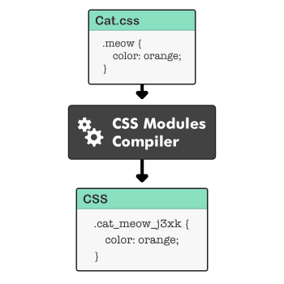

# 6주차 과제
## CSS in CSS
### CSS 모듈
**CSS 모듈**은 CSS를 모듈화하여 사용하는 방식이다.
CSS 클래스를 만들면 자동으로 고유한 클래스 네임을 만들어서 scope를 지역적으로 제한한다.

[^1]

모듈화된 CSS를 번들러로 불러오면 다음과 같이 사용자가 정의했던 클래스네임과 고유한 클래스네임으로 이뤄진 객체가 반환된다.

#### 장점
- CSS 클래스의 이름이 중복되어도 새로운 이름이 입혀져 중복 및 관리의 위험성이 적다.
- CSS 네이밍 규칙이 간소화된다.

#### 단점
- 한 곳에서 모든 것을 작성하지 않으므로 별도로 많은 CSS 파일을 만들어 관리해야 한다.

### CSS 전처리기
**CSS 전처리기**는 자신만의 특별한 문법을 가지고 CSS를 생성하는 프로그램이다.
CSS의 문제점을 변수, 함수, 상속 등 일반적인 프로그래밍 개념을 사용하여 보완한다.

#### 장점
- 재사용성: 공통 요소 또는 반복적인 항목을 변수 또는 함수로 대체할 수 있다.
- 개발 시간과 비용 절약: 임의 함수와 내장 함수를 사용하여 절약할 수 있다.
- 코드 유지 및 관리 용이: 중첩, 상속과 같은 요소를 통해 만들 수 있다.

#### 단점
- 전처리기를 위한 도구가 필요하다.
- 다시 컴파일하는데 시간이 소요된다.

#### Sass
가장 먼저나온 전처리기이다. 

Sass 기반인 SCSS가 더 흔히 쓰이는데, SCSS 뜻은 Sass한 CSS라는 뜻이다. 즉, Sass에서 CSS 문법을 사용할 수 있기 때문에 기존 들여쓰기와 줄바꿈에 의존하는 문법인 Sass와 다르게 CSS에서 사용하는 중괄호를 사용해 컴파일 에러를 줄일 수 있다.

#### Less
트위터의 부트스트랩에 사용되면서 알려졌다. 자바스크립트 문법을 취하고 있으며 Node.js 기반으로 구동된다.

#### Stylus
상대적으로 프로그래밍 언어의 특징을 많이 가지고 있다.
그래서 CSS 내에서 연산자나 함수, 루프 등을 비교적 자유롭게 사용할 수 있다.

## CSS in JS
자바스크립트 코드에서 CSS를 작성하는 방식이다.

### 장점
- 중복되지 않는 class 이름을 고려할 필요가 없다.

- JS 코드와 CSS가 상태 값을 공유할 수 있다.

- 컴포넌트와 스타일 코드를 쉽게 오갈 수 있다.

- 자동으로 벤더 프리픽스를 붙여준다.

  - 벤터 프리픽스: 브라우저마다 따로 놀던 CSS3의 속성을 각각의 브라우저들이 인식할 수 있게 하기 위해 만들어졌다.
    ```css
    -webkit-border-radius: 10px; //크롬, 사파리
    -moz-border-radius: 10px; // 파이어폭스
    -o-border-radius: 10px; //오페라
    -ms-border-radius: 10px; //인터넷 익스플로러
    border-radius: 10px;
    ```

### 단점
- 러닝 커브
- 새로운 의존성 발생
- 별도의 라이브러리 설치에 따른 번들 크기 증대
- CSS in CSS에 비해 느린 속도

### runtime
CSS in js의 동작 방식 중 하나로, 자바스크립트 런타임에서 필요한 CSS를 동적으로 만들어 적용한다.
이 방식을 쓰는 라이브러리는 styled-component, emotion 등이 있다.

그중 styled-component는 스타일링을 위한 코드 사용량이 줄어들고 CSS 문법에 친화적이다.

```html
<style>
  title {
    font-size: 15px;
    color: white;
  }
</style>
<h1 class="title">Hello World!</h1>
```
*CSS 기본 작동 방식*

```javascript
import styled from "styled-components";

const Title = styled.h1`
  font-size: 15px;
  color: white;
`;
<Title>Hello World!</Title>
```
*styled-components 기본 작동 방식*

- CSS 파일을 생성하지 않으므로 CSS-loader가 필요없다.
- 런타임 오버헤드[^2]가 발생할 수 있다.

### zero-runtime
런타임에 CSS를 생성하지 않으면서 페이지를 더 빨리 로드할 수 있다.
JS 번들에서 styles 코드를 모두 실행해야 페이지가 로드된다.

대표적인 라이브러리는 linaria와 vanilla-extract가 있다.

- 런타임에서 스타일이 생성되지 않는다. props 변화에 따른 동적인 스타일은 CSS 변수를 통해 적용한다.

- webpack 설정을 해야한다.[^3]

- 첫 로드는 빠르지만, 첫 페인트는 느릴 수 있다.
CSS styles까지 모두 로드가 되어야 첫 페인트를 시작한다.
runtime에서는 스타일을 로드하면서 첫 페인트를 시작할 수 있다.(예, 로딩화면)

### near-zero-runtime
SSR 환경에서도 잘 동작이 되도록 만들어졌다.
런타임 오버헤드와 제로 런타임의 제약을 해결하여 더 빨라졌다.

런타임에서 각각의 CSS 프로퍼티가 Atomic CSS처럼 적용된다.
- Atomic CSS: 필요한 수치를 입력을 해두면 필요한 CSS를 자동으로 생성을 해두는 주문형(on-demand) 패러다임.

  스타일 시트 사이즈를 줄일 수 있다는 장점이 있다.

  대표적인 라이브러리는 `tailwindcss`가 있다.

## CSS in CSS vs CSS in JS
개발할 때 중점을 두고 싶은 부분에 따라 사용하는게 제일 좋다.

- CSS in CSS
  
  렌더링 시 모든 CSS 요소를 로딩하기 때문에 사용자 편의에 방점을 둔 웹 프로젝트에 사용하는 것이 좋다.

- CSS in JS

  개발 효율성에 중점을 둔 컴포넌트 위주의 프로젝트에 사용하는 것이 좋다.

## tailwindCSS
**tailwindCSS**는 Utility-First 컨셉을 가진 CSS 프레임워크다.

미리 세팅된 유틸리티 클래스를 활용하는 방식으로 HTML 코드 내에서 스타일링을 할 수 있다.

```html
<button class="py-2 px-4 rounded-lg shadow-md text-white bg-blue-500">
  Click me
</button>
```

### 장점
- Utility-First: 스타일 코드도 HTML 코드 안에 있기 때문에 HTML과 CSS 파일을 별도로 관리할 필요가 없으므로 개발 효율이 상승된다. 또, 클래스명을 검색해가며 일일이 필요한 CSS 코드를 찾을 수고도 사라진다.

- 일관된 디자인: 모든 곳에서 동일한 색상이나 사이즈, 간격 등의 유틸리티 클래스를 사용해 일관된 스타일로 구현하기가 쉬워진다.

- 쉽고 자유로운 커스텀: 다른 프레임워크들에 비해 기본 스타일 값을 디테일한 부분까지 쉽게 커스텀이 가능하다. 기본 스타일을 수정하는 방식이기 때문에 디자인 일관성도 해치지 않는다. 따라서 디자인 시스템이나 다크 모드 구현도 간편하게 할 수 있다.

- 로우 레벨의 스타일 제공: 각 CSS 요소 수준의 유틸리티 클래스를 제공하기 때문에 세밀하게 원하는 디자인을 구현할 수 있다.

- Intelli Sense: 플러그인이다. 미리보기, 자동완성, 구문 강조, 린팅을 지원하기 때문에 쉽게 개발할 수 있다. 

- 자바스크립트 코드와의 분리: 프로젝트 진행 도중 자바스크립트 프레임워크를 변경해도 큰 추가 작업없이 기존의 HTML 코드를 그대로 쓸 수 있다.

### 단점
- 못생긴 코드
  ```HTML
  <div
    class="bg-primary-darken text-bold text-white inline-flex items-center p-4 rounded shadow-md"
  >
    Not Pretty Code 😵
  </div>
  ```

  스타일을 많이 적용할 수록 클래스가 길어져서 코드가 더러워보인다.

- 초반 클래스명 러닝 커브: 초반에 각 스타일의 클래스명을 익혀야 해서 개발하는 내내 문서를 참고해야 하는 번거로움이 있으나 Intelli Sense 플러그인으로 극복 가능하다.

- JavaScript 코드 사용 불가: styled-components와 같이 JavaScript 변수 값에 따라 가로 길이를 설정하는 등의 구현은 가능하기는 하지만 무척 번거로운 설정이 필요하다. 

- HTML와 CSS 코드 혼재

[^1]: [What are CSS Modules? A visual introduction](https://www.javascriptstuff.com/what-are-css-modules/)

[^2]: 어떤 처리를 하기 위해 들어가는 간접적인 처리 시간 · 메모리

[^3]: webpack은 모듈 번들러로 웹 앱 개발에 필요한 다양한 요소들을 하나의 파일로 병합 및 압축을 하는 역할을 한다.